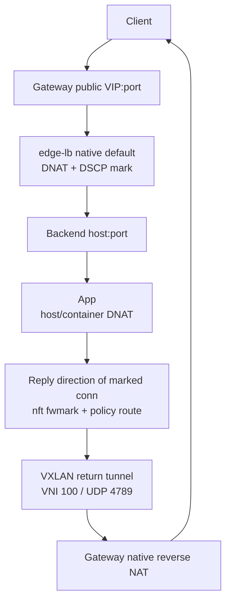

# Edge LB

**English** | [简体中文](README.zh-CN.md)

A layer-4 load-balancing agent for cloud VPCs. edge-lb uses its built-in native
DNAT/SNAT datapath while preserving the **real client IP** seen by backends.

## The problem it solves

A cloud VPC only forwards traffic whose destination MAC/IP belongs to the
VM. When a gateway performs default DNAT and preserves the client source IP,
the backend's replies are destined to the public client and cannot be routed
back through the gateway inside the VPC. Asymmetric routing breaks the
connection, while SNAT-based modes lose the real client IP.

Edge LB's design:



Only connections marked by the gateway return through the VXLAN tunnel;
traffic hitting the backend's public IP directly is untouched.

## Quick start

On x86_64 Linux (or use the Docker-based targets in the `Makefile` from
any host):

```bash
make ebpf release      # eBPF object + x86_64 release binary
make ui                # optional: management UI (bun + rolldown-vite)
BIN=target/x86_64-unknown-linux-gnu/release/edge-lb

# The role is written to /etc/edge-lb/config.toml:
sudo $BIN install backend

# Optional bootstrap overrides are written together with the role:
# --node-name, --underlay-ip, --public-ip, --underlay-dev,
# --vni, --vxlan-port and --dscp. Use --force to replace an existing config.

edge-lb verify         # both paths + eBPF counters
```

Packaging lives in `scripts/package.sh`, `scripts/deb.sh`, and
`deploy/container.Dockerfile`.

## Commands

```bash
edge-lb --config /etc/edge-lb/config.toml # run the configured node_role
edge-lb ui serve                         # management API/UI (default
                                         # 127.0.0.1:18080; also started by the
                                         # gateway daemon)
edge-lb verify                           # VIP path + direct path + eBPF stats
edge-lb config validate|init             # validate / write annotated,
                                         # role-aware config templates
edge-lb install [gateway|backend]        # install systemd service
edge-lb uninstall service                # remove systemd service
```

Every default is overridable on the CLI (`--help` for the full list).

## Configuration

`/etc/edge-lb/config.toml`, organized by role. The deploy templates are split
by role and keep local identity at the top level, with gateway-only control/API
settings under `[gateway.*]`, and backend-only subscription/return-path
settings under `[backend.*]`:

```toml
node_role = "gateway"        # gateway | backend
[discovery]                  # auto discovery for local IPs and route device
[gateway.ha]                 # gateway failover
[gateway.xds]                # xDS-like control plane listener
[gateway.network]            # overlay/VXLAN/DSCP source of truth
[gateway.api]                # management UI/API
[backend.xds]                # backend subscribes to gateway xDS
[backend.return_path]        # backend nft/route return-path settings
```

Architecture: **[docs/architecture.md](docs/architecture.md)** (Chinese).
Full configuration guide: **[docs/config.md](docs/config.md)** (Chinese);
deploy templates are split by role: `deploy/config.gateway.example.toml` and
`deploy/config.backend.example.toml`. Listener configuration is managed through
the gateway UI/API and persisted under `state_dir`, not in TOML.

## Management UI / API

`edge-lb ui serve` (or the gateway daemon, which starts it automatically):
node status, listener configuration, target groups, automatic target groups,
notifications, manual failover, apply, and cleanup. Destructive actions always
show a summary of what will change before running.

Standalone `ui serve` also delivers pending HA configuration snapshots for the
gateway role, but does not start BFD or the datapath. It must own its `state_dir`
exclusively; do not run it alongside a gateway daemon using the same database.

```text
GET     /api/v1/status
GET     /api/v1/nodes/gateways
GET     /api/v1/nodes/backends          (runtime xDS registrations)
GET/POST/PUT/DELETE /api/v1/listener-configs[/{name}]
GET/POST/PUT/DELETE /api/v1/target-groups[/{name}]
GET/POST/PUT/DELETE /api/v1/automations[/{name}]
GET/POST /api/v1/notifications
GET/DELETE /api/v1/notifications/{id}
POST    /api/v1/notifications/{id}/test
GET/PUT /api/v1/ha/config
GET     /api/v1/ha/status
POST    /api/v1/ha/failover
POST    /api/v1/operations/{apply|cleanup}
```

The server binds `127.0.0.1:18080` by default. Listening on a
non-loopback address requires `gateway.api.auth_token` (Bearer). API calls
must also match `gateway.api.trusted_source_cidrs`; an empty list derives the
local underlay subnet automatically.

## Repository layout

```text
edge-lb/          user-space agent (CLI / daemon / HTTP API / systemd install)
edge-lb-ebpf/     DSCP marker and native datapath eBPF (Rust + Aya)
edge-lb-common/   shared types
ui/               Vue 3 + TypeScript + rolldown-vite panel (built with bun)
deploy/           systemd units, deploy/install scripts, example configs
docs/             current architecture, configuration, API and verification docs
```

## Building

- The user-space crate depends on aya, which only compiles on Linux:
  `make check / clippy / test` wrap everything in a Docker container
  (works on Apple Silicon).
- The eBPF object needs `nightly-2025-12-01` and `bpf-linker` v0.11.0:
  install the prebuilt `bpf-linker` release, then run `make ebpf`.
- The frontend uses bun: `make ui`.
- Tarballs: `make package`; role-specific Debian packages:
  `make deb` creates `edge-lb-gateway_<version>_<arch>.deb` and
  `edge-lb-backend_<version>_<arch>.deb`; local container image:
  `make container-image`. Multi-platform image push:
  `make container-image-push`.

## Caveats

- Failover is Active/Standby: switching guarantees recovery of **new**
  connections; existing connections break. Moving the public entry point
  (EIP binding) is outside the agent's scope.
- The native datapath currently targets IPv4 TCP/UDP default DNAT first.
  Other NAT/proxy modes are intentionally outside the first working version.
