# edge-lb 架构说明

## 当前目标

当前运行时不需要外部负载均衡器、容器运行时或第三方 LB API。edge-lb 自己维护
监听配置、目标组、native DNAT/SNAT 数据面、VXLAN 回程和 HA 控制面。

edge-lb 将 native default DNAT、DSCP 标记和 VXLAN 回程封装成一个可部署的四层
负载均衡 agent。核心路径要求后端服务看到真实客户端 IP，因此默认使用不改写源
地址的 native default 模式。

## 角色边界

```mermaid
flowchart LR
    client["客户端"]
    gw_pub["gateway 公网入口<br/>203.0.113.10:48080"]
    marker["eth0 ingress<br/>DSCP marker pref 1"]
    lb["edge-lb native DNAT<br/>default mode"]
    backend["backend underlay<br/>192.168.0.14/192.168.0.16:58080"]
    app["后端应用"]
    nft["backend nft<br/>ct mark + fwmark"]
    ret["edge-return<br/>VXLAN 回程"]
    hub["edge-hub<br/>gateway VXLAN hub"]
    revnat["edge-lb reverse NAT"]

    client --> gw_pub --> marker --> lb --> backend --> app
    app --> nft --> ret --> hub --> revnat --> client
```



- gateway：唯一管理入口，负责监听/目标组 API、native DNAT eBPF、DSCP eBPF、
  `edge-hub`、xDS-like gRPC 控制面、UI/API 和 HA。
- backend：只连接 gateway xDS，接收快照后配置 `edge-return`、nft、策略路由
  和 MSS clamp；不运行 HA、不保存业务配置、不提供管理 UI。
- target group：配置后端地址、权重和健康探测；listener 配置监听 VIP、监听端口、
  转发目标端口、协议、策略以及目标组引用。

## 控制面

backend 启动后按 `[backend.xds].gateway` 连接 gateway gRPC。注册请求上报
`node_name`、实际 `public_ip`、实际 `underlay_ip`，以及 IP 发现模式和来源
（如 `auto/stun`、`auto/udp_source`、`static/config`）。gateway 在内存维护活动
订阅，断线即移除，避免 UI 展示失效节点。VXLAN 节点页面和自动配置目标组的
backend 选择只使用当前活动订阅；已经下线的节点不会展示，也不会参与目标组生成。
edge-lb 不持久化 VXLAN/backend 在线列表。overlay 分配只在当前进程内的活动订阅
映射中保持稳定。

backend 每次收到 snapshot 后，会在设置 `edge-return` 前做本机预检查：
planned overlay CIDR 是否和本机非托管网卡网段重叠、planned overlay IP 是否已被
其他网卡占用、policy rule priority 是否被其他规则占用、return route table 是否
已有非 edge-lb 预期路由，以及主路由表是否已有覆盖 overlay 网段的非 VXLAN 路由。
检查结果不直接阻断收敛，而是随 xDS ACK/NACK 上报给 gateway，gateway 在活动订阅
和 VXLAN 节点页面展示；冲突消失后下一次 ACK 会自动清空展示。gateway 侧构建
快照时读取 SQLite 的 `ha_active_gateway/current` 判定 active 网关；该资源引用未知
网关会记录告警并回退到有效网关（backend 保持现有数据面并重试）。

backend 策略路由通过 rtnetlink 收敛，采用 **dump 驱动**方式：每轮收敛先做一次
`RTM_GETRULE` dump、再对每个 edge-lb 表做 `RTM_GETROUTE` dump，全程复用一个
netlink socket。规则层只删除"属于 edge-lb mark/table 范围且不再是期望状态"的
规则，绝不按 priority 段盲删。路由层按表区分所有权：

- **派生表**（id 落在 edge-lb 派生范围内，见下节）为 edge-lb 全量拥有——表内凡
  不符合期望形态的路由直接删除。failover 换网关、网关改 IP、本机 underlay 变化
  留下的残留路由由这里自愈，不存在"判为外来路由而永久 bail"的死角。
- **用户配置表**（bootstrap 的 `[backend.return_path].route_table_id`，如 100）
  只按 edge-lb 路由**形状**触碰（默认路由走 VXLAN 设备、目的为网关 underlay 且
  源为本机 underlay 的主机路由），表内其他程序的路由不受影响。

所有路由写入使用 `NLM_F_CREATE|NLM_F_REPLACE` 原子替换：已正确的路由不会被
先删后建，失败时原有路由保持原位。规则
优先级被外来规则占用时自动顺延，不覆盖。每个回程端口的 DSCP 超出 0..=63 时
直接报错，不再静默截断为 DSCP 0 匹配。

gateway 下发的 snapshot 只包含 backend 数据面所需内容：active gateway、
overlay CIDR、gateway VXLAN 接口名、VNI、VXLAN 端口、MTU、DSCP、gateway/backend
节点清单，以及当前 default-mode listener + target group 推导出的本 backend
相关回程端口。gateway/backend 节点清单保持全量下发，用于 VXLAN overlay 拓扑；
业务相关的运行期服务投影和 `backend_return_ports` 按订阅 backend 的 underlay IP
裁剪。不同 backend 可以收到不同的后端目标、转发端口、权重和回程端口。

HA 多 gateway 下，backend 会同时配置多套回程路径。回程 mark 和 route table 由
**(gateway slot, DSCP)** 二元组派生，单一实现在 `config/model.rs`：

```text
slot  = 网关在按 underlay 排序的网关清单中的序号（每台网关独立计算，天然互异）
mark  = 0x1000 | ((slot+1) << 6) | dscp      # slot 0 → 0x1040..0x107f
table = 1000 + (slot+1)*64 + dscp            # slot 0 → 1064..1127
```

两台 gateway 即使配置相同 DSCP 也不会共享 mark/table。backend nft 按 DSCP
区分回程连接打 `ct mark`，policy route 再把不同 mark 的回包送入对应 gateway
的 VXLAN 下一跳。
`edge-return` 同时持有多个本地 overlay 地址和多个 VXLAN FDB peer；overlay
镜像地址与网关自身或其他 backend 已占地址冲突时跳过并告警，不抢占。

HA 配置写入采用 MASTER 权威、BACKUP 转发并回写副本。监听、目标组和自动配置
目标组会同步，但监听的 VIP 不作为副本数据传播：每台 gateway 本地自动加入自身
underlay IP，L2 共享 VIP 由本地 HA 状态绑定并通过 GARP 宣告，再写入本机 native
eBPF。这样备机不会错误绑定主机的 underlay 或把共享 VIP 当成普通监听字段复制。

## 数据面

1. 客户端访问 gateway 的监听 VIP 和端口。
2. gateway `eth0 ingress` 上的 DSCP eBPF 只匹配 default-mode listener 的 VIP 端口，将
   DSCP 设为 EF，同时保留 ECN bits。
3. gateway native DNAT 将目标地址改写为 backend underlay，不改客户端源 IP。
4. backend nft 对 DSCP EF 正向连接设置 `ct mark`，回包方向继承为 `fwmark`。
5. backend 策略路由将已标记回包送入 `edge-return`。
6. gateway `edge-hub ingress` 上的 native reverse NAT 恢复监听 VIP 后返回客户端。

非 default-mode listener 和直连 backend 公网 IP 的流量不会由 edge-lb 自动加入 DSCP
回程路径，不会被策略路由送入 VXLAN。

## 配置和持久化

- `/etc/edge-lb/config.toml`：bootstrap 配置，只保存本机身份、自动发现、角色参数。
- `/var/lib/edge-lb/edge-lb.sqlite3`：gateway 的监听、目标组、自动配置模板、
  HA 配置、通知配置、运行态清理边界和健康观测数据，由 SeaORM SQLite
  repository 统一读写。
- eBPF map、flow map、TC attachment、VXLAN/FDB 和策略路由是运行时内核状态，
  由 gateway/backend heal 幂等收敛，不作为业务配置文件持久化。

## 目标组运行态

native 模式不把后端目标作为独立的配置资源。目标组中的每个后端目标会结合监听
目标端口展开到 eBPF runtime map，并由 probe worker 更新健康状态。目标组页面
展示目标和探测状态；内部 target key 只是数据面派生标识，不参与 listener
配置引用，也不作为 API 资源暴露。

## HA 边界

目标 HA 是带连接同步的 Active/Standby。MASTER gateway 权威维护监听和目标组，
BACKUP 通过 xDS-like 控制面接收副本；native flow map 通过受信任的 HA 通道同步。
切换时只有 MASTER 绑定 VIP、发送 GARP 并承担入口流量，BACKUP 保持数据面待命。
backend 同时维护两个 gateway 的 VXLAN 回程信息，并依据 gateway 独立的 DSCP/mark
派生值选择正确的回程路径。
