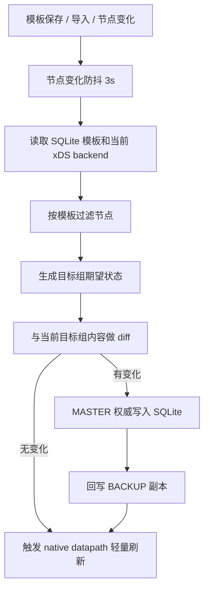

# 自动配置目标组

本文只描述当前 edge-lb native 版本的自动化模型。自动化不创建监听配置，
只根据 xDS 注册的 backend 节点维护目标组；监听配置通过目标组名称绑定。

## 设计边界

- 自动化对象是 `automation template`，UI 展示为「自动配置目标组」。
- 一个模板只维护一个目标组，模板名称自动生成为 `template-{target_group}`。
- 目标组可以在没有匹配节点时先创建为空，方便监听配置提前绑定。
- 节点上线、下线或元数据变化后，gateway 延迟 3 秒防抖再 reconcile。
- 模板只包含节点过滤规则和健康探测规则；不包含监听协议、对外端口、调度策略、
  转发模式、转发目标端口或权重。
- 目标组是健康探测的最小单位。目标组只有被监听配置引用后才启动探测；
  未被引用时 UI 展示为「未关联监听」。

## 数据模型

模板持久化到 SQLite 的 resource document：

```text
resource_type = automation_template
resource_name = template-{target_group}
```

模板内容：

```json
{
  "name": "template-rustpbx",
  "enabled": true,
  "target_group": "rustpbx",
  "node_scope": "filtered",
  "node_filter": {
    "match": "all",
    "conditions": [
      { "field": "name", "op": "prefix", "value": "VM-" },
      { "field": "underlay_ip", "op": "in_cidr", "value": "192.168.0.0/16" }
    ]
  },
  "probe": {
    "monitor": true,
    "probe_type": "tcp",
    "probe_port": 8080,
    "period_secs": 15,
    "retries": 3,
    "probe_req": "discover",
    "probe_resp": "hostname"
  },
  "remove_policy": "prune"
}
```

## 过滤规则

过滤规则使用结构化条件，不引入表达式语言。多条件固定为 AND。

| 字段 | 操作符 | 说明 |
|---|---|---|
| `name` | `equals` / `not_equals` / `prefix` / `not_prefix` / `contains` / `not_contains` / `regex` | 节点名称 |
| `underlay_ip` / `public_ip` | `equals` / `not_equals` / `in_cidr` / `not_in_cidr` | IP 或 CIDR |
| `public_ip_source` / `underlay_ip_source` | `equals` / `not_equals` / `prefix` / `not_prefix` / `contains` / `not_contains` / `regex` | 发现方式 |

前端保存前校验正则表达式和 CIDR，后端持久化时再次校验。负向操作符保留为
一等语义，不要求用户用负向正则表达式绕行。

## Reconcile



Reconcile 必须是 level-triggered：同样输入重复执行应当 no-op，不允许重复创建
目标组、重复写健康探测或导致数据面反复挂载。

## HA 写入模型

- MASTER 是业务配置唯一写入权威。
- BACKUP 收到模板写入请求时只转发给 MASTER。
- MASTER 写入 SQLite 成功后，把同一资源副本回写到 BACKUP。
- BACKUP 只保存副本和展示状态，不独立评估并写入业务配置。
- 切主后，新 MASTER 使用本地 SQLite 副本和当前 xDS 节点视图重新评估。

## API

```text
GET/POST   /api/v1/automation-templates
GET/PUT/DELETE /api/v1/automation-templates/{name}
POST       /api/v1/automation-templates/{name}/test
GET        /api/v1/automation-templates/export
POST       /api/v1/automation-templates/import
```

导入支持 dry-run 预检和三种策略：跳过同名、覆盖同名、替换全部。导入成功后
立即触发 reconcile。

## UI 约束

- 导航名称为「自动配置目标组」，位置在「监听配置」之前。
- 新增/编辑模板弹窗只展示：启用状态、目标组名称、过滤规则、健康探测配置。
- 不展示监听协议、VIP、对外端口、调度策略、转发模式、目标端口和权重。
- 模板列表展示启用状态、目标组名称、过滤摘要、探测摘要、最近执行结果。
- 导入/导出使用 JSON，保存成功后关闭弹窗并刷新列表。

## 验证

1. 无匹配节点时保存模板，目标组存在且 targets 为空。
2. backend 注册后 3 秒内目标组自动加入该节点。
3. backend 下线后目标组按 `remove_policy=prune` 移除该节点。
4. 目标组内容未变化时重复 reconcile 不写 SQLite、不刷新完整 datapath。
5. BACKUP 写入模板时请求转发到 MASTER，MASTER 成功后 BACKUP 副本一致。
