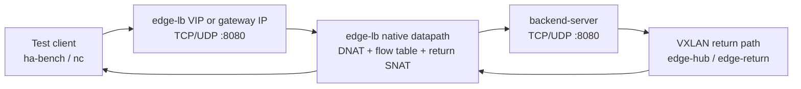
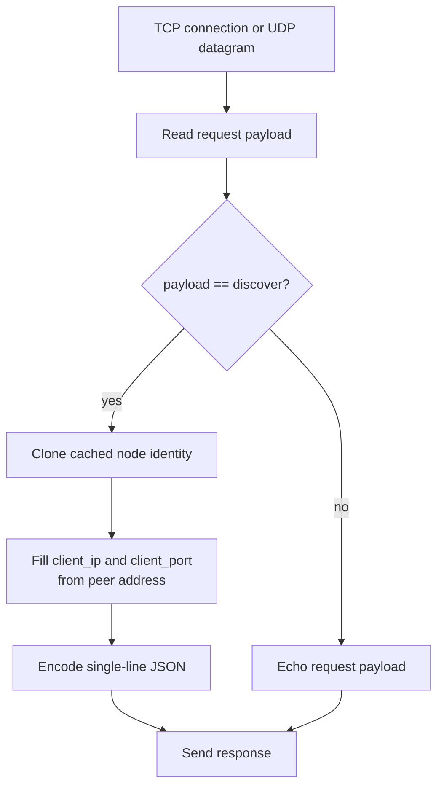

# backend-server

English | [简体中文](README.zh-CN.md)

`backend-server` is a small TCP/UDP backend identity service for edge-lb
load-balancing validation. It listens on TCP and/or UDP, returns the backend
node identity for the `discover` payload, and echoes other non-empty payloads.

The service is useful when validating edge-lb scheduling algorithms such as
`hash`, `rr`, `lc`, `persist`, and `priority`: each response includes the
backend hostname, private IPv4, public IPv4/IPv6, and the client address seen
by the backend.

## Architecture



`backend-server` does not participate in load balancing. It only exposes a
stable TCP/UDP service on each backend node so edge-lb can prove which backend
was selected and what client address the backend observed.

## Request Flow



## Build

From the edge-lb workspace root:

```sh
make backend-server
```

Or build directly with Cargo:

```sh
cargo build --release -p backend-server
```

## Run

Listen on both TCP and UDP `0.0.0.0:8080`:

```sh
backend-server -serve -listen 0.0.0.0:8080
```

Listen on TCP and UDP separately:

```sh
backend-server -tcp 0.0.0.0:8080 -udp 0.0.0.0:8080
```

## Validate

```sh
printf 'discover\n' | nc -v -w 3 127.0.0.1 8080
printf 'discover\n' | nc -uv -w 3 127.0.0.1 8080
```

Example response:

```json
{"hostname":"backend-a","private_ipv4":"192.0.2.10","public_ipv4":"203.0.113.10","public_ipv6":"","client_ip":"198.51.100.20","client_port":53124}
```

For hash validation, pin the client source port:

```sh
printf 'discover\n' | nc -v -p 12345 -w 3 <vip-or-gateway-ip> 8080
printf 'discover\n' | nc -uv -p 12345 -w 3 <vip-or-gateway-ip> 8080
```

The same five-tuple should stay on the same backend while the flow exists.

## Docker

The Dockerfile expects architecture-specific binaries under `dist/docker/`:

```sh
mkdir -p dist/docker
cp target/x86_64-unknown-linux-gnu/release/backend-server dist/docker/backend-server-amd64
docker build -t backend-server:latest tools/backend-server
```

Host-network deployment:

```sh
docker compose -f tools/backend-server/compose.host-network.yml up -d
```

## CLI

```text
Usage of backend-server:
  -debug
        debug mode
  -field string
        return only a single field. Options are: "hostname", "publicv4", "publicv6", "privatev4"
  -provider string
        ignored
  -serve
        run TCP and UDP response service
  -listen string
        listen address for -serve TCP and UDP service (default "0.0.0.0:8080")
  -tcp string
        run TCP response service on this address
  -udp string
        run UDP response service on this address
```

Environment overrides:

| Variable | Effect |
|---|---|
| `UNDERLAY_IP` | Use this IPv4 as `private_ipv4` |
| `PUBLIC_IP` | Use this IPv4 as `public_ipv4` |
| `STUN_SERVERS` | Comma-separated STUN servers, `host[:port]` |
| `STUN_SERVER` | Single-server override when `STUN_SERVERS` is unset |

Discovery runs once at startup and is cached for service responses.
