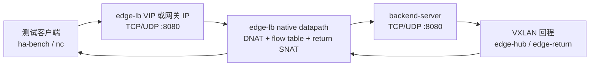
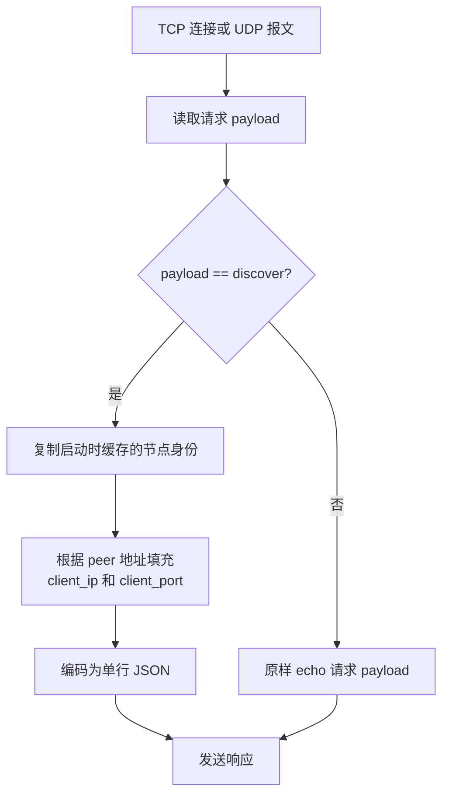

# backend-server

[English](README.md) | 简体中文

`backend-server` 是 edge-lb 负载均衡验证用的 TCP/UDP 后端身份服务。它监听
TCP 和/或 UDP，请求内容为 `discover` 时返回当前后端节点身份信息；其他非空
payload 原样 echo。

它主要用于验证 edge-lb 的调度算法，例如 `hash`、`rr`、`lc`、`persist`、
`priority`。返回内容包含后端主机名、内网 IPv4、公网 IPv4/IPv6，以及后端实际
看到的客户端地址。

## 架构



`backend-server` 不参与负载均衡。它只是在每个 backend 节点上暴露一个稳定的
TCP/UDP 服务，方便 edge-lb 验证实际选中的后端，以及后端看到的客户端地址。

## 请求流程



## 构建

在 edge-lb workspace 根目录执行：

```sh
make backend-server
```

或者直接用 Cargo 构建：

```sh
cargo build --release -p backend-server
```

## 运行

同时监听 TCP 和 UDP `0.0.0.0:8080`：

```sh
backend-server -serve -listen 0.0.0.0:8080
```

分别指定 TCP/UDP 监听地址：

```sh
backend-server -tcp 0.0.0.0:8080 -udp 0.0.0.0:8080
```

## 验证

```sh
printf 'discover\n' | nc -v -w 3 127.0.0.1 8080
printf 'discover\n' | nc -uv -w 3 127.0.0.1 8080
```

响应示例：

```json
{"hostname":"backend-a","private_ipv4":"192.0.2.10","public_ipv4":"203.0.113.10","public_ipv6":"","client_ip":"198.51.100.20","client_port":53124}
```

验证 hash 调度时可以固定客户端源端口：

```sh
printf 'discover\n' | nc -v -p 12345 -w 3 <vip-or-gateway-ip> 8080
printf 'discover\n' | nc -uv -p 12345 -w 3 <vip-or-gateway-ip> 8080
```

同一个五元组在 flow 存活期间应该稳定落到同一个后端。

## Docker

Dockerfile 需要先把对应架构的二进制放到 `dist/docker/`：

```sh
mkdir -p dist/docker
cp target/x86_64-unknown-linux-gnu/release/backend-server dist/docker/backend-server-amd64
docker build -t backend-server:latest tools/backend-server
```

主机网络部署：

```sh
docker compose -f tools/backend-server/compose.host-network.yml up -d
```

## 命令行

```text
Usage of backend-server:
  -debug
        debug mode
  -field string
        return only a single field. Options are: "hostname", "publicv4", "publicv6", "privatev4"
  -provider string
        ignored
  -serve
        run TCP and UDP response service
  -listen string
        listen address for -serve TCP and UDP service (default "0.0.0.0:8080")
  -tcp string
        run TCP response service on this address
  -udp string
        run UDP response service on this address
```

环境变量：

| 变量 | 作用 |
|---|---|
| `UNDERLAY_IP` | 直接作为 `private_ipv4` 返回 |
| `PUBLIC_IP` | 直接作为 `public_ipv4` 返回 |
| `STUN_SERVERS` | STUN 服务器列表，逗号分隔，格式 `host[:port]` |
| `STUN_SERVER` | `STUN_SERVERS` 未设置时的单服务器配置 |

服务模式下发现信息只在启动时执行一次，之后响应使用缓存结果。
